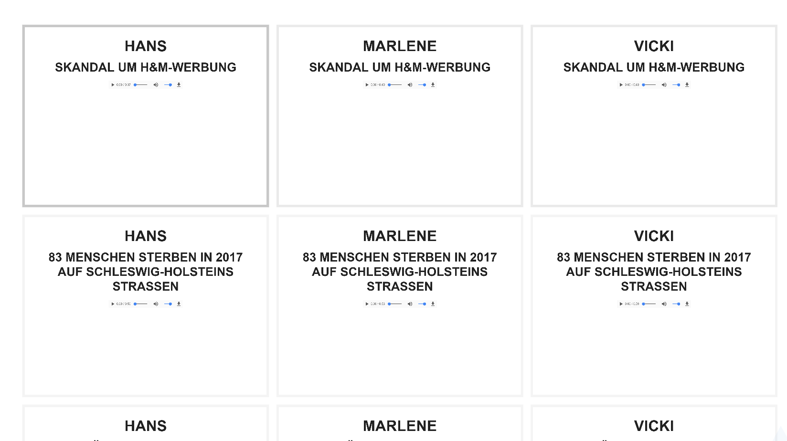

## See the results

Here is the site: https://mvtango.github.io/ambientnews-voiceboard/20170109/

## Blinking by yourself

Here you can compose your own blinking patterns:

https://mvtango.github.io/ambientnews-voiceboard/blink.html

A pattern looks like this:

https://mvtango.github.io/ambientnews-voiceboard/blink.html?red*0.5,white*1,red*0.5,white*1,white*10

## How to build

This is a static site genrator. It works in three stages:

Stage 1: From [this Google Spreadsheet](https://docs.google.com/spreadsheets/d/1j-ToesOWAD109EWyrFJwrHQNfhKusRlQnADKWeh983Q/edit#gid=0) to JSON documents in `static/items`:  `make get-data`

Stage 2: From each JSON document in `static/items` to 

  - a .md file in `content/20170109/` using jinja2filter - `make cards`
  
  - an mp3 file in `static/spoken/` using `polly.py` - `make mp3s`

 
Stage 3: From .md and .mp3 files to a `revealjs` slide deck

## Dependecies

  - [jinja2filter.py](https://github.com/martinvirtel/jinja2filter.py)
  - [jsonforge](https://bitbucket.org/datenfreunde/jsonforge)
  - [hugo](https://gohugo.io/)

You also need a file named .credentials which contains 

## Useful links

The HTML is generated using a derivative of this Hugo theme:
https://github.com/minoritea/hugo-revealjs-generator
